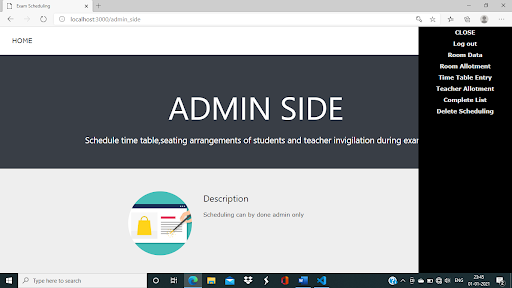
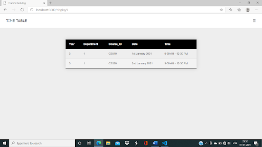

# Exam-Scheduling

  

Simple website using NodeJS and MySQL which is used to allot rooms for students, teachers for invigilation and time table creation.

In this work, an examination management system, a web-based application test administration software, is suggested to manage various online examination settings. The proposed system stands out for its excellent architecture designs, user-friendliness, wealth of features, flexibility, and extensibility. This project can be used to assign students to rooms and assign exam rooms. By entering the students' USN, we may even see their schedule.

## Design of Database

## Screenshot

   

   

## Features

1. We can allot a room in a particular building to conduct  the examination. 
2. We allot students into a particular room. 
3. We allot teachers into a particular room for invigilation. 
4. We schedule exams by entering students and course data. 
5. Display various examinations scheduled for students. 
6. Display teacher allocation.

